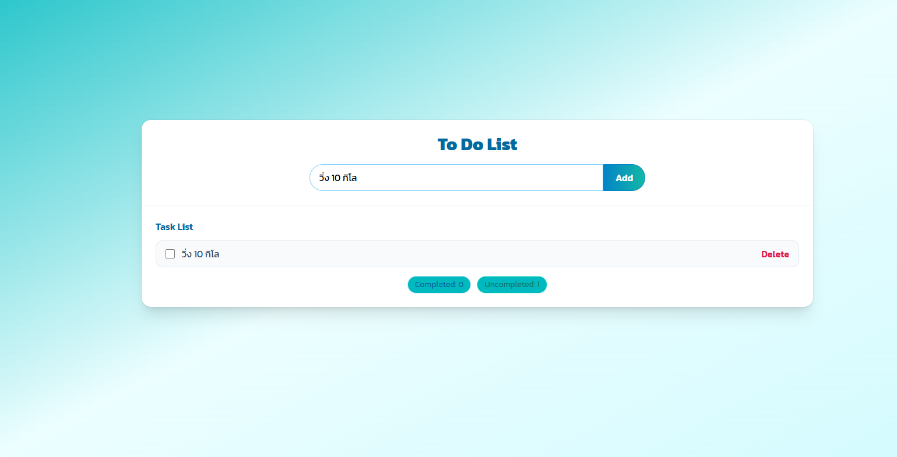
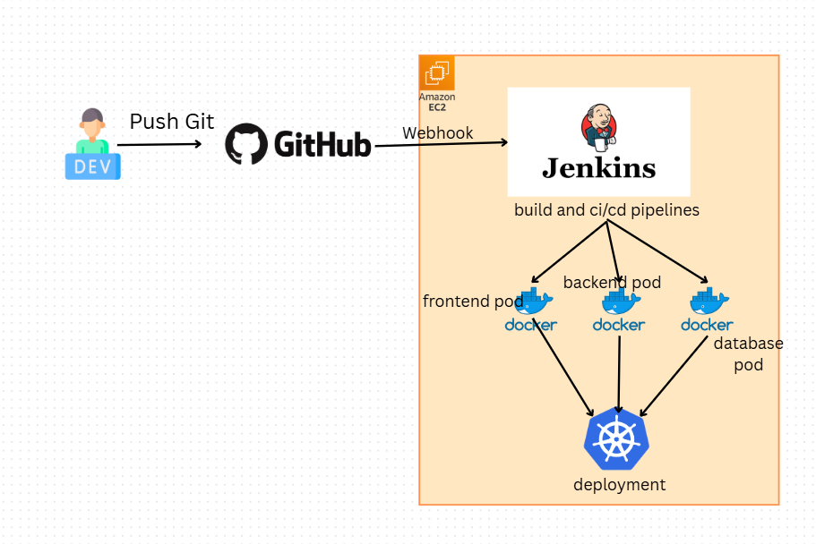
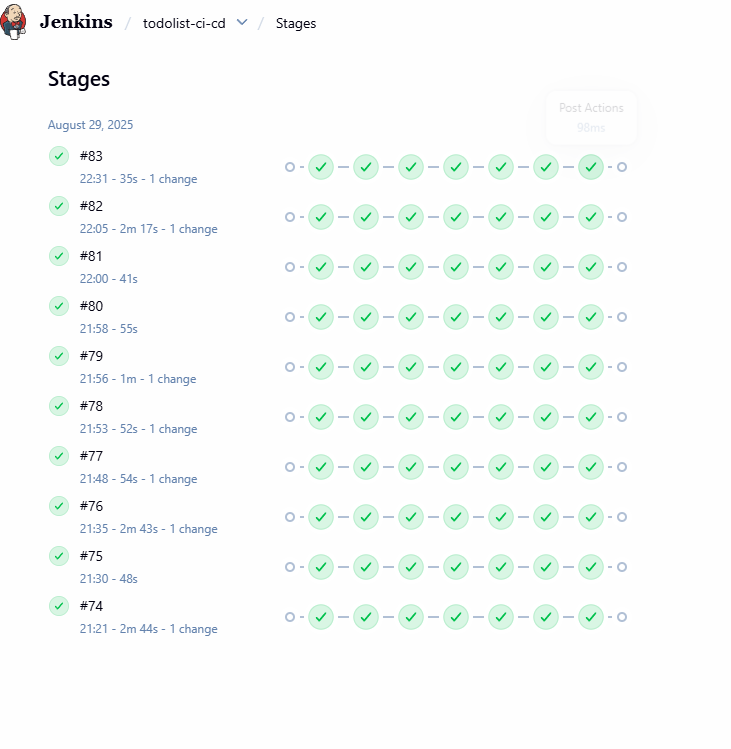
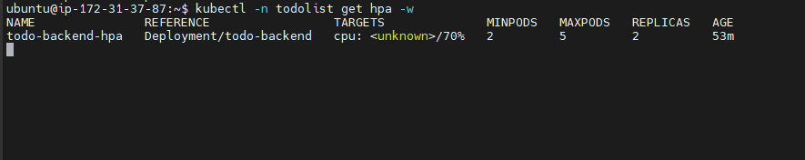

# 📝 TodoList Project Deployment (CI/CD + Kubernetes + Auto Scaling)

## 📌 webapp เพิ่ม ลด รายการลิสต์ที่ต้องทำ



## 📌 Architecture



- **Dev**: push code ไปที่ GitHub
- **GitHub**: trigger Jenkins ผ่าน Webhook
- **Jenkins (บน EC2)**: build pipeline → สร้าง Docker image (FE, BE, DB)
- **Kubernetes Cluster**: deploy pod (frontend, backend, database)
- **HPA (Horizontal Pod Autoscaler)**: scale backend pod อัตโนมัติเมื่อมีโหลด

---

## 🚀 Pipeline Steps (Jenkinsfile)

1. **Build**

   - Backend → `mvn package` → `app.jar`
   - Frontend → `npm run build` → `dist/`

2. **Dockerize & Push**

   - สร้าง Docker image (FE/BE)
   - Push ขึ้น DockerHub

3. **Deploy to Kubernetes**
   - `kubectl apply -f namespace.yaml`
   - `kubectl apply -f storageclass-ebs.yaml`
   - `kubectl apply -f postgres-pvc.yaml`
   - `kubectl apply -f todolist-app.yaml`
   - `kubectl apply -f todo-backend-hpa.yaml`



---

## 🛠️ Kubernetes Manifests

- `namespace.yaml`
- `storageclass-ebs.yaml`
- `postgres-pvc.yaml`
- `todolist-app.yaml`
- `todo-backend-hpa.yaml`

---

## 📊 K8s Testing (Auto Scaling)



### 1. Run Load Test

```bash
k6 run tests/k8s-loadtest.js


```
